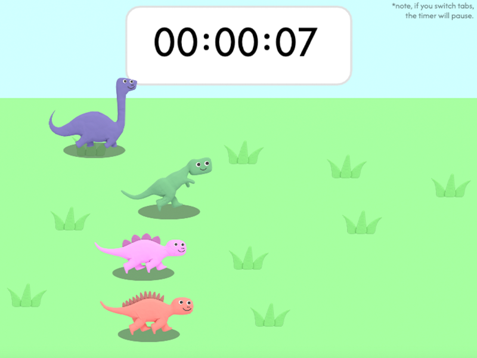

# WELCOME TO DINO TIMER

Check out the [Live Site!](https://ncioffi1.github.io/Dino_Timer/)

## Summary

Dino Timer is a reimagining of an old online application called Dino Race.  In Dino Timer, a user can set a timer for themselves.  As the timer clicks closer to 0, 4 dinos will race to the finish line.  Only one of them can win the race, though.  Which dino will win?  When the timer hits 0, the user will see for themselves which dino is the champion. 

The technologies used to create this project include the following:

* Languages:  Javascript, HTML, and CSS
* Hosting:  Github Pages

# Functionality and MVPs 

## In this app, users are able to:
* Set a timer for an amount of time of their choosing (>10 seconds).
* Watch the dinos race while listening to some quality, royalty free music.
* Set up another race once the race finishes.

